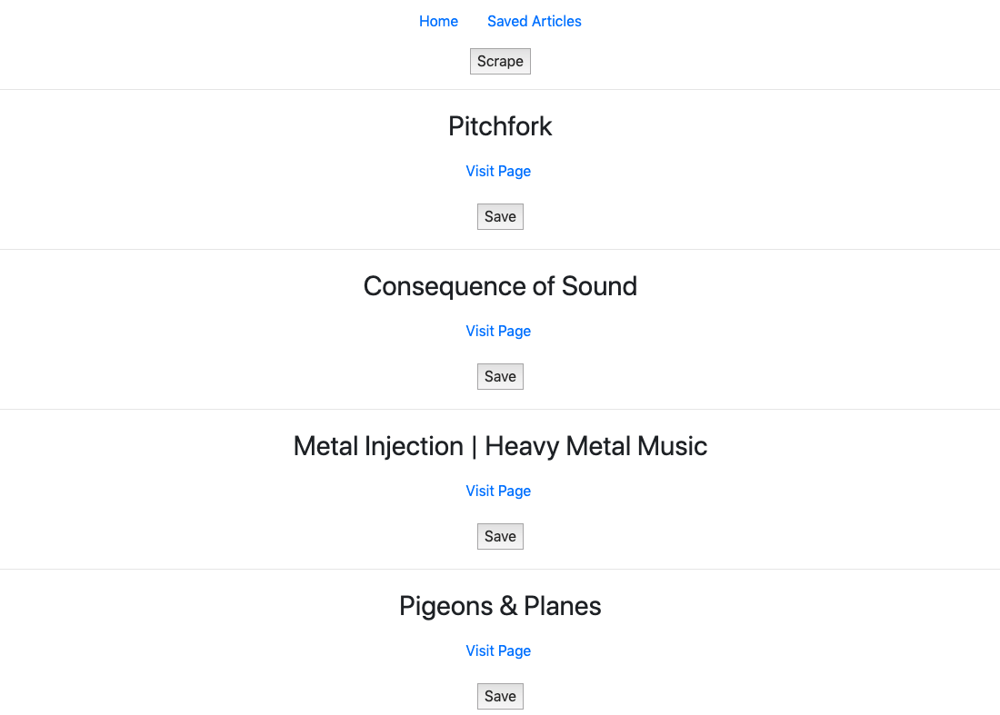
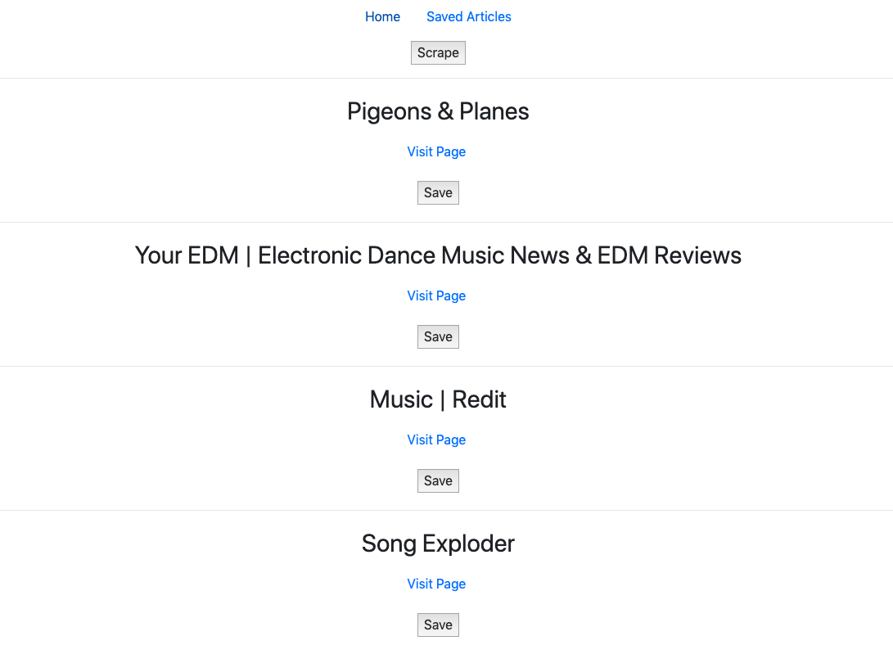
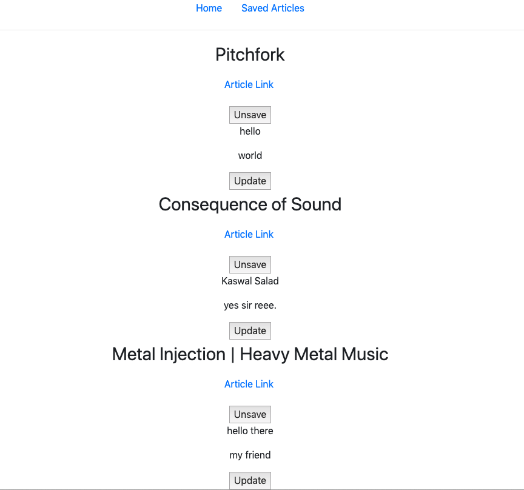
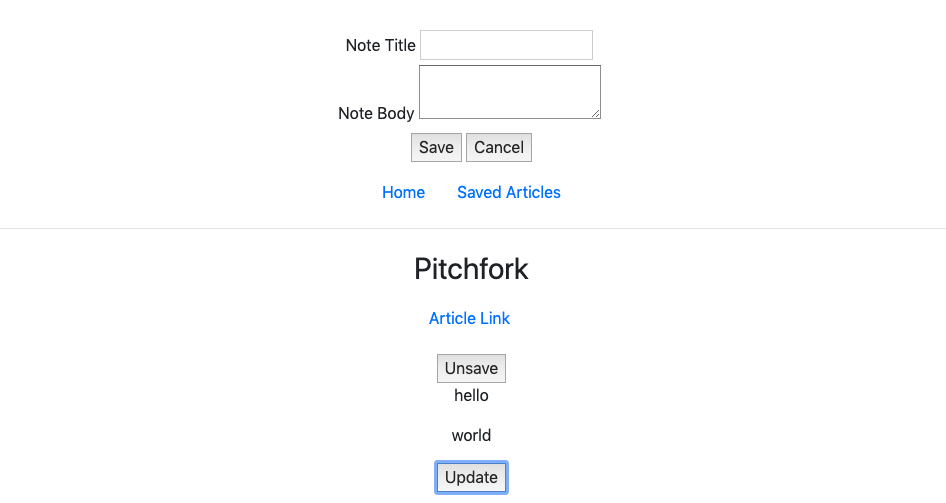

# Music Blog Scrapper

This is my submission for homework assignment number 14: Scrapping. We were tasked with creating a web application that allows users the ability to 'scrape' a site for content. For my application, I chose to scrape for music blogs. The user can view and leave comments on each of the blogs provided. If a user enjoys a particular blog, they may also 'save' it where the music blog is then moved to the saved tab of my scraping web app. In order to accomplish this, I had to utilize my understanding of jQuery, JavaScript, Cheerio, Express, Axios, Express-Handlebars, Mongoose, Bootstrap, HTML, & CSS.

[visit the deployed site](https://arcane-lake-59733.herokuapp.com/)

# Images

##  Initial Page Load

## Saving the First Three Blogs

## Saved Blogs w/ Attached Notes

## Ability to Edit Saved Notes

# Tech I Used:

[HTML](https://www.w3schools.com/html/)

[Bootstrap](https://getbootstrap.com/docs/4.3/getting-started/introduction/)

[CSS](https://www.w3schools.com/css/)

[JavaScript](https://www.w3schools.com/js/)

[jQuery](https://www.w3schools.com/jquery/)

[Cheerio](https://www.npmjs.com/package/cheerio)

[Express-Handlebars](https://www.npmjs.com/package/express-handlebars)

[Express](https://www.npmjs.com/package/express)

[Axios](https://www.npmjs.com/package/axios)

[Mongoose](https://www.npmjs.com/package/mongoose)

# Author:

[Matthew Hagarty](https://github.com/matthewryanhagarty)